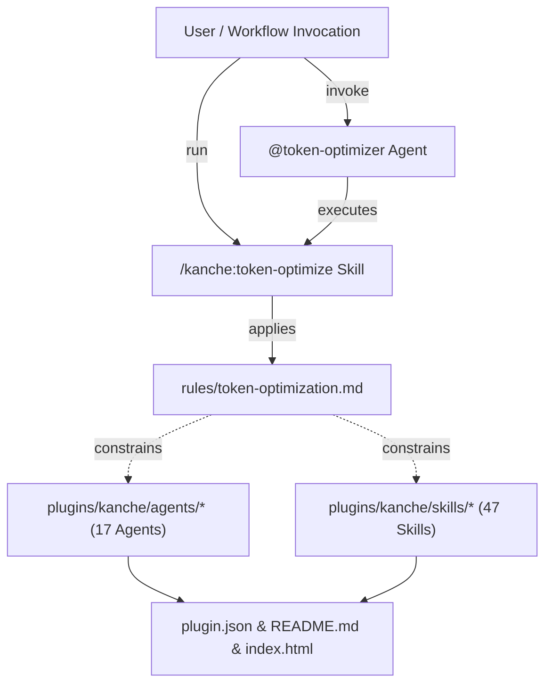

# System Architecture & Technical Design: Token Optimizer Agents & Global Token Optimization

- **Feature:** Token Optimizer Agents & Global Token Optimization
- **Slug:** `token-optimizer`
- **PBI:** `PBI-20260926-token-optimizer`
- **Domain:** `optimizer`

## Approach
Introduce a specialized prompt and token engineering architecture to the `kanche` developer suite:
1. **Subagent `@token-optimizer`**: A specialized subagent in `plugins/kanche/agents/token-optimizer/agent.json` that audits prompt text, SKILL.md definitions, and agent system prompts to eliminate token bloat, strip conversational padding, deduplicate instructions, and enforce telegraphic high-density structure.
2. **Skill `/kanche:token-optimize`**: A standalone skill providing structured token auditing, AST/markdown compaction, and token measurement (`--path`, `--auto-apply`, `--budget`).
3. **Universal Token Rule `rules/token-optimization.md`**: A foundational rule file detailing:
   - Telegraphic sentence structure without loss of semantics.
   - Removal of polite/conversational framing ("Please note that...", "In this step, we will...").
   - Consolidation of repetitive invariants into centralized references.
   - Structured tabular schemas over loose prose.
   - Prompt caching friendly layouts (static invariant preambles followed by dynamic sections).
4. **Global Application**: Systematic optimization of all 16 existing agents in `plugins/kanche/agents/` and 46 skills in `plugins/kanche/skills/` using the token optimization principles.
5. **UI & Catalog Integration**: Expand team count from 16 to 17 agents across `plugin.json`, `README.md`, and `index.html`.

## Architecture Context



## Components & File Layout

1. **`plugins/kanche/agents/token-optimizer/agent.json`**:
   - `name`: `"token-optimizer"`
   - `model`: `"flash"`
   - `description`: Token economy and prompt distillation agent.
   - `system_prompt`: Telegraphic, high-density instructions for context pruning, deduplication, and token budgeting.
   - `tools`: `["read_file", "view_file", "grep_search", "list_dir"]` (Read-only).

2. **`plugins/kanche/skills/token-optimize/SKILL.md`**:
   - Frontmatter: name `token-optimize`, model `flash`.
   - Inputs: `<target-path>`, `--auto-apply`, `--budget=<max_tokens>`, `--format=json|text`.
   - Process: Measures current character/token count, identifies redundancy/bloat, applies telegraphic compression, verifies functional invariance, outputs savings report.

3. **`plugins/kanche/rules/token-optimization.md`**:
   - Defines standard compaction heuristics: telegraphic phrasing, tabular schemas, deduplication, no conversational filler, prompt caching optimization.

4. **Optimized Agents (`plugins/kanche/agents/*/agent.json`)**:
   - Refactor system prompts to maximize token density while preserving exact operational boundaries, tools, and roles.

5. **Optimized Skills (`plugins/kanche/skills/*/SKILL.md`)**:
   - Prune verbosity in skill markdown while preserving inputs, steps, schemas, and review interfaces.

6. **Documentation & UI (`plugin.json`, `README.md`, `index.html`)**:
   - Update agent roster to 17 subagents, register `token-optimize` skill, add styling card in `index.html`.

## Interfaces & CLI Contracts

### Skill `/kanche:token-optimize`
```bash
/kanche:token-optimize [target-path] [--auto-apply] [--budget=<tokens>] [--format=json|text]
```
- `target-path`: File or directory to audit and optimize (default: current workspace or targeted skill/agent).
- `--auto-apply`: Automatically write optimized content to disk.
- `--budget`: Target maximum token count.
- Output: Emits token audit summary (Original tokens, Optimized tokens, % Saved, Semantics Verified).

## Data & State Changes
No database schema changes. Configuration and prompt definition additions and updates only.

## Alternatives Considered
- *External Tokenizer Dependency (e.g. tiktoken Python package)*: Rejected to avoid adding external binary or Python dependency requirements. Estimation uses standard ~4 chars/token heuristic or native token counters.
- *Over-aggressive Minification (stripping all explanations)*: Rejected to avoid damaging model comprehension and human readability.

## Risks & Mitigations
- **Risk:** Truncation of subtle safety requirements.
  - **Mitigation:** Explicit invariant checks ensure `destructive-safety.md`, `default_api:ask_question`, and review interfaces remain verbatim and intact.
