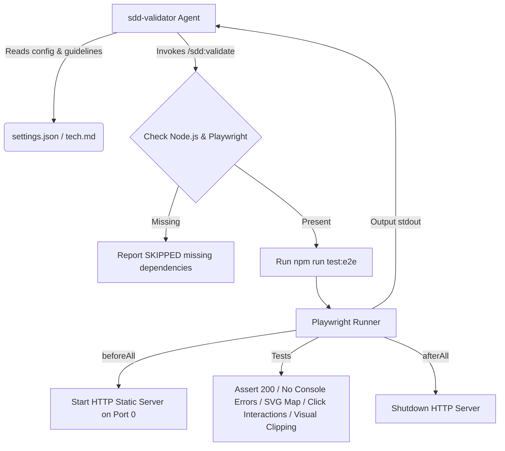

# Technical Design: Playwright Browser Validation for SDD

## Approach
Introduce end-to-end browser-based testing for the registry dashboard (`index.html`) and the SDD inspector (`plugins/sdd/index.html`) using Playwright. 
To ensure zero port conflicts and simplify configuration, the Playwright suite will spin up a Node.js-native HTTP static file server on a dynamic OS-allocated free port (port `0`) within a `beforeAll` hook, and shut it down in an `afterAll` hook.
The validation suite will run headlessly using Chromium by default to optimize speed and resource usage.
The `/sdd:validate` skill will run the suite via a new script script registered in `package.json` (`npm run test:e2e`). If Node.js, Playwright, or browser binaries are missing in the local environment, the suite will gracefully report `SKIPPED (missing dependencies)` instead of failing the validation phase.

## Architecture context
This feature adds automated visual and functional browser checks during the validation phase (P5) of the SDD lifecycle.



## Components

1. **`package.json`** (New at repository root):
   - Defines devDependency `@playwright/test`.
   - Exposes `test:e2e` run script.
   - Collaborators: Node.js npm, Playwright test runner.

2. **`playwright.config.js`** (New at repository root):
   - Configures test folder, timeouts (30s max), workers (1 to ensure no port conflicts), reporter (`list`), and headless Chromium project.
   - Collaborators: Playwright runner.

3. **`tests/dashboard.spec.js`** (New test suite):
   - **Static HTTP Server**: Native Node.js `http` and `fs` modules serving the workspace root, listening on dynamic port `0`.
   - **Test cases**:
     - *Root Dashboard Loading*: Navigation to `/index.html`, asserts HTTP 200, no JS errors/warnings, and 3 active plugin buttons are present.
     - *Connections Map & Interactions*: Navigation to `/plugins/sdd/index.html`, asserts HTTP 200, no JS errors/warnings, checks `#connection-map-svg` exists with >= 15 command nodes, clicks `[data-node-id="/sdd:run"]` node, and verifies `#details-header-section .details-title` contains `/sdd:run`.
     - *Layout Clipping Check*: Evaluates overall viewport scroll dimensions to check for layout clipping/blowout (asserts document `scrollWidth <= clientWidth`).
   - Collaborators: `index.html`, `plugins/sdd/index.html`.

4. **`.sdd-docs/settings.json`** (Modified):
   - Adds the configuration block specifying browser testing under validation.

5. **`.sdd-docs/guidelines/tech.md`** (Modified):
   - Updates `Build/Test/Lint/Run Commands` to define the test runner commands for e2e/browser validation.

6. **`plugins/sdd/skills/validate/SKILL.md`** (Modified):
   - Mentions checking for Node/Playwright dependencies and handling skipped states.

## Interfaces
- **Command Line**: `npm run test:e2e` executes `npx playwright test`.
- **Validation Suite Output Table Row**:
  `browser/e2e | npm run test:e2e | PASS / FAIL / SKIPPED (missing dependencies) | X tests run, Y failed`
- **Config JSON Schema** (`.sdd-docs/settings.json`):
  ```json
  "validation": {
    "browser": {
      "enabled": true,
      "port": "auto",
      "framework": "playwright"
    }
  }
  ```

## Data changes
- Configuration block added to `.sdd-docs/settings.json` as shown in specs.

## Alternatives
- **Alternative 1: Use Chrome DevTools MCP tools directly**
  - *Why rejected*: Playwright CLI provides a standard, robust, headless, multi-browser assertions framework that requires no external agent runtime loop. Chrome DevTools MCP is better suited for agent-controlled browser interaction rather than deterministic test suites.
- **Alternative 2: Run a standalone background process for the static server**
  - *Why rejected*: Standalone servers (e.g. `http-server`) require process monitoring, manual cleanup, and port collision handling. Inlining the HTTP server into Playwright's `beforeAll` / `afterAll` hooks using a port of `0` ensures clean OS-level port assignment and perfect server lifecycle encapsulation.

## Risks
- **Risk**: Missing dependencies (Node.js, Playwright, or browser binaries) in containerized execution environments.
  - *Mitigation*: The `/sdd:validate` execution logic checks for dependency presence before invoking the command. If missing, it prints a message and logs `SKIPPED (missing dependencies)` instead of returning a non-zero exit code or throwing a validation failure.
- **Risk**: Horizontal overflow in dashboard pages causing false negatives.
  - *Mitigation*: The scrollWidth check ensures that only unexpected body-level overflows fail the tests, while map scroll containers with `overflow-x: auto` are allowed to handle local overflows correctly.
