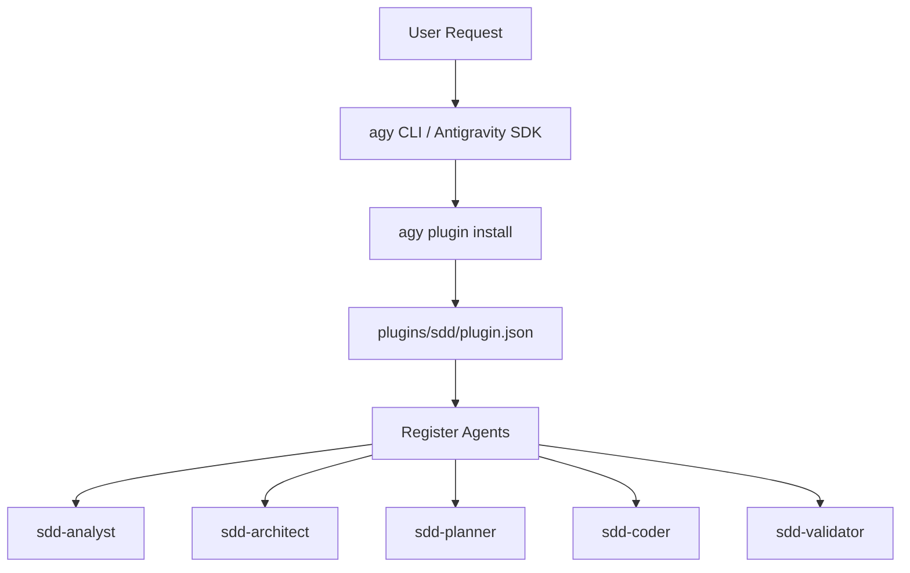

# Design: Specialized SDD Subagents

## Approach
Our strategy is to leverage the Google Antigravity custom plugin system schema to define 5 specialized subagents for the SDD plugin. Each agent is mapped to a subset of phase-based skills in the SDD workflow. We will structure the configuration JSON files for these subagents under the `plugins/sdd/agents/` directory, update the main `plugin.json` for registration, and update the dashboard UI in `index.html` to reflect these updates to the user.

## Architecture context
The `sdd` plugin executes as part of the client registry. Defining agents under a plugin bundle allows `agy` CLI's installation parser (`agy plugin install`) to discover, validate, and load these definitions into the workspace system memory (e.g. `.agents/` configurations).



## Components
1. **SDD Manifest Config**: `plugins/sdd/plugin.json`
   - Responsibility: Declare the list of subagent configuration file paths.
2. **Subagent Definitions**:
   - `plugins/sdd/agents/sdd-analyst/agent.json`
     - Responsibility: Handles specs analysis & reviews. Write tools: `false`.
   - `plugins/sdd/agents/sdd-architect/agent.json`
     - Responsibility: Handles architecture design & reviews. Write tools: `false`.
   - `plugins/sdd/agents/sdd-planner/agent.json`
     - Responsibility: Handles planning, task list drafting & reviews. Write tools: `true`.
   - `plugins/sdd/agents/sdd-coder/agent.json`
     - Responsibility: Handles code build modifications & reviews. Write tools: `true`.
   - `plugins/sdd/agents/sdd-validator/agent.json`
     - Responsibility: Handles validation, synchronization, and run controllers. Write tools: `false`.
3. **Registry Dashboard View**: `index.html`
   - Responsibility: Render command descriptions referencing the new delegated subagents to improve visual clarity of the agentic workflow.

## Interfaces
- **Manifest Interface**: Each `agent.json` must follow the configuration structure:
  ```json
  {
    "name": "string",
    "description": "string",
    "system_prompt": "string",
    "enable_write_tools": boolean,
    "enable_mcp_tools": boolean,
    "enable_subagent_tools": boolean
  }
  ```

## Data changes
None. No databases are used in this static site registry plugin structure.

## Alternatives
- **Alternative 1**: Create a single subagent `sdd-operator` (similar to `git-operator`).
  - *Why rejected*: A single operator must have write tools enabled, which violates the security design boundary for the analysis and review phases where read-only access is preferred.
- **Alternative 2**: Define 16 subagents mapping 1-to-1 to each skill.
  - *Why rejected*: Introducing 16 separate definitions creates excessive duplicate boilerplate files and overhead during SDK plugin loading.

## Risks
- **Risk**: Write tool restrictions in `sdd-analyst` or `sdd-architect` preventing files from being saved.
- **Mitigation**: Confirmed that skills return data blocks directly to the parent runner workflow or CLI rather than writing them directly to files in these specific review loops.
