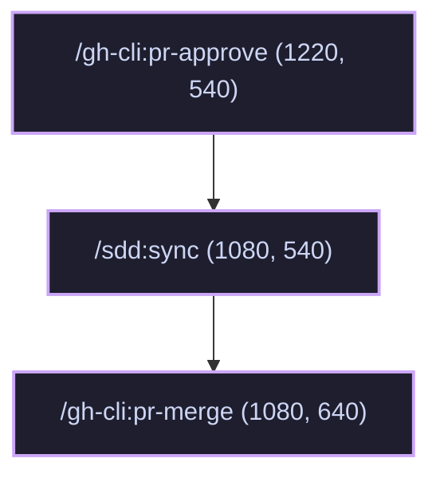

# SDD P9 Alignment Sequence Optimization — Technical Design

<!-- schema: design | written by /sdd:sync-product (dev-only sections stripped) -->

## Approach
Reorder the SDD Level 2 alignment sequence (P9) to execute `/sdd:sync` (and its nested git commit/push) on the feature branch *before* merging the PR. This ensures that all finalized product documentation is part of the PR's merge commit and avoids branch protection issues on the default branch. After doc synchronization, the orchestrator polls CI/status checks on the newly pushed commit and merges the PR using the `/gh-cli:pr-merge` skill, which automatically handles branch deletion.

The interactive graph dashboard in `plugins/sdd/index.html` will be updated to reflect this new logical flow by adjusting node positions, updating edges, and adding the missing P7-P9 steps to the `/sdd:run` command details steps panel.

## Components
- **`plugins/sdd/skills/run/SKILL.md` (Modified)**:
  - Update the P9 step sequence under `### P7–P9 — Level 2 Automation (PR Review, Merging & Alignment)`:
    - Auto mode: Run `/sdd:sync`, commit and push changes to remote feature branch. Wait/poll for status checks on the new commit (using interval and count from `.sdd-docs/settings.json`). Once passed, run `/gh-cli:pr-merge` to merge the PR and clean up local/remote branches.
    - Manual mode: Add step gating. Prompt user to run `/sdd:sync` to push docs to feature branch. Prompt user to run `/gh-cli:pr-merge` to merge the PR and delete branch.
  - Update phase model diagram in `## Phase model` to swap `/gh-cli:pr-merge` and `/sdd:sync`.
- **`plugins/sdd/index.html` (Modified)**:
  - Update coordinate registry for the following nodes:
    - `/sdd:sync`: `x: 1080, y: 540, phase: "P9 Sync"`
    - `/gh-cli:pr-merge`: `x: 1080, y: 640, phase: "P9 Merge"` (updated phase from `"P8 Merge"`)
  - Update connector edges array:
    - Remove: `{ from: "/gh-cli:pr-approve", to: "/gh-cli:pr-merge", type: "sequence" }`
    - Remove: `{ from: "/gh-cli:pr-merge", to: "/sdd:sync", type: "sequence" }`
    - Remove: `{ from: "/sdd:sync", to: "/git:branch-delete", type: "sequence" }`
    - Add: `{ from: "/gh-cli:pr-approve", to: "/sdd:sync", type: "sequence" }`
    - Add: `{ from: "/sdd:sync", to: "/gh-cli:pr-merge", type: "sequence" }`
  - Update `/sdd:run` steps list in command details panel:
    - Append steps:
      - `P7: Human review`
      - `P8: PR mods & approval`
      - `P9: Sync documentation & Merge`

## Interfaces & Configs
The polling intervals and maximum attempts are retrieved from `.sdd-docs/settings.json`:
```json
{
  "pr_polling": {
    "interval_seconds": 30,
    "max_attempts": 3
  }
}
```
If `.sdd-docs/settings.json` is missing or properties are undefined, the orchestrator defaults to 30 seconds interval and 3 maximum attempts.

## Graph Transitions
Below is the visual transition map showing the reordered flow in P9:



## Risks & Alternatives
- **CI / Status Checks Timeout**: If status checks take too long, the automation loop might time out or exhaust retries.
  - *Mitigation*: Fall back to prompting the user in manual mode or logging a warning and holding the merge in auto mode. The user can configure `pr_polling` properties to fit their CI runtimes.
- **Merge Conflicts during /sdd:sync**: Other changes merged to main might conflict with the feature branch docs.
  - *Mitigation*: The feature branch must be kept up-to-date. In case of conflict, git hooks or validate phase would fail, forcing manual rebasing.
