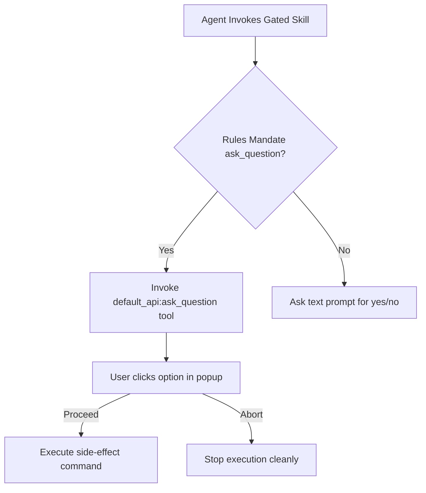

# Technical Design - Interactive Gating via AskQuestion

## Approach
We will transition the text-based yes/no prompts to the structured `default_api:ask_question` tool. This will be accomplished by:
1. Updating the global gating rules in the plugins (`plugins/sdd/rules/workflow-gating.md`, `plugins/git/rules/git-hard-rules.md`, and `plugins/gh-cli/rules/gh-hard-rules.md`) to explicitly mandate using the `default_api:ask_question` tool instead of text prompts for confirmations.
2. Modifying individual skill files (`SKILL.md`) in `git`, `gh-cli`, and `sdd` to describe the use of the `default_api:ask_question` tool, specifying the question content to show and the options to present.

## Architecture Context
The plugins define the behavior of the AI agent. By detailing the use of `default_api:ask_question` within the rules and skills, any agent interpreting these plugins will execute `default_api:ask_question` instead of writing raw text prompting for a raw text reply.



## Components
The modified component files will be:
- **sdd plugin rules/skills:**
  - `plugins/sdd/rules/workflow-gating.md`
  - `plugins/sdd/skills/run/SKILL.md`
- **git plugin rules/skills:**
  - `plugins/git/rules/git-hard-rules.md`
  - `plugins/git/skills/branch-delete/SKILL.md`
  - `plugins/git/skills/commit/SKILL.md`
  - `plugins/git/skills/pull/SKILL.md`
  - `plugins/git/skills/push/SKILL.md`
  - `plugins/git/skills/rebase/SKILL.md`
  - `plugins/git/skills/tag-create/SKILL.md`
  - `plugins/git/skills/tag-delete/SKILL.md`
  - `plugins/git/skills/tag-push/SKILL.md`
- **gh-cli plugin rules/skills:**
  - `plugins/gh-cli/rules/gh-hard-rules.md`
  - `plugins/gh-cli/skills/pr-approve/SKILL.md`
  - `plugins/gh-cli/skills/pr-create/SKILL.md`
  - `plugins/gh-cli/skills/pr-merge/SKILL.md`
  - `plugins/gh-cli/skills/pr-respond/SKILL.md`
  - `plugins/gh-cli/skills/pr-review/SKILL.md`

## Interfaces
All gated prompts will follow this standard tool call structure:
```json
{
  "questions": [
    {
      "question": "Descriptive question summarizing context, command, and impact",
      "options": [
        "(Recommended) Yes, proceed",
        "No, abort"
      ],
      "is_multi_select": false
    }
  ],
  "toolSummary": "Human gating confirmation",
  "toolAction": "Asking for confirmation"
}
```

## Alternatives
- **Alternative 1: Keep text-based prompt** (Rejected: Less user-friendly, breaks automated UI flows).
- **Alternative 2: Automatic execution without gating** (Rejected: High risk of executing unwanted git/PR side effects).

## Risks
- None.
