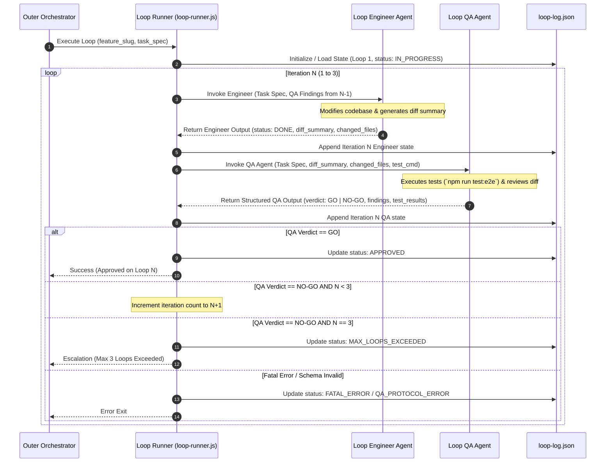

# Loop Engineer System — System Design Specification

<!-- schema: design | written by /sdd:design -->

## Approach

The **Loop Engineer System** implements a closed-loop, subagent-driven iterative development and verification engine. It establishes an inner feedback loop between a dedicated **Engineer Agent** (`loop-engineer-agent`) and a **QA Agent** (`loop-qa-agent`), coordinated by a deterministic **Loop Runner Controller** (`plugins/loop-engineer/scripts/loop-runner.js`).

Key design choices:
1. **Plugin Architecture**: Modular placement under `plugins/loop-engineer/` adhering to the repository's AGY plugin structure (`plugin.json`, `agents/`, `skills/`, `scripts/`).
2. **Subagent Separation**: Isolation of developer logic (code modification) and QA logic (test execution & code review) into distinct subagents with explicit interface contracts and system prompts.
3. **Hard Bounds**: Strict 3-iteration cap enforced by the state machine in `loop-runner.js` before subagent invocation, eliminating infinite loop risks.
4. **Structured Schema Validation**: QA feedback payload and persistent logs strictly validated against JSON Schemas (`loop-log.json` and `qa-feedback.json`).
5. **Idempotence & State Recovery**: Complete execution history persisted to `.sdd-docs/development/{feature_slug}/loop-log.json`, allowing state resumption upon process interruption.

---

## Architecture Context

The Loop Engineer System integrates into the AGY plugins suite as `plugins/loop-engineer/`. It interfaces with the outer SDD lifecycle (invoked during P4 Build or P5 Validate phases) and standard test scripts (`npm run test:e2e`).

```
+-----------------------------------------------------------------------------------+
|                              SDD Lifecycle / User                                 |
+-----------------------------------------------------------------------------------+
                                          |
                         /loop-engineer:run --feature=<slug>
                                          v
+-----------------------------------------------------------------------------------+
|                        Loop Runner Controller (loop-runner.js)                     |
|  - Manages LoopExecution State Machine (1..3 iterations)                           |
|  - Validates JSON Schemas & Enforces 600s Subagent Timeout                        |
|  - Persists State to .sdd-docs/development/{slug}/loop-log.json                   |
+-----------------------------------------------------------------------------------+
           |                                                      ^
   1. Invoke (Task + QA Feedback)                         3. Return QA Verdict
           v                                                      |
+---------------------+     2. Staged Code Edits     +------------------------------+
| Loop Engineer Agent | ---------------------------> |         Loop QA Agent        |
| (Implementation)    |                              | (Test Execution & Code Review)|
+---------------------+                              +------------------------------+
```

### Data Flow & Sequence Diagram



---

## Components

### 1. Plugin Manifest (`plugins/loop-engineer/plugin.json`)
- **Responsibility**: Declarative metadata and registration of subagents, skills, and rules.
- **Source File**: `plugins/loop-engineer/plugin.json`
- **Collaborators**: AGY Plugin Loader, Local Plugin Marketplace (`.agents/plugins/marketplace.json`).

### 2. Loop Command Skill (`plugins/loop-engineer/skills/loop/SKILL.md`)
- **Responsibility**: Exposes slash command `/loop-engineer:run` for launching or resuming the inner loop.
- **Source File**: `plugins/loop-engineer/skills/loop/SKILL.md`
- **Collaborators**: `plugins/loop-engineer/scripts/loop-runner.js`.

### 3. Loop Runner Controller (`plugins/loop-engineer/scripts/loop-runner.js`)
- **Responsibility**: State machine execution, iteration tracking (max 3), subagent invocation wrapping, timeout control (600s), schema validation, and persisting state to `loop-log.json`.
- **Source File**: `plugins/loop-engineer/scripts/loop-runner.js`
- **Collaborators**: `Loop Engineer Agent`, `Loop QA Agent`, `.sdd-docs/development/{feature_slug}/loop-log.json`.

### 4. Loop Engineer Agent (`plugins/loop-engineer/agents/engineer/agent.json`)
- **Responsibility**: Receives task spec and prior QA findings; modifies files in the codebase; verifies local syntax/diff; outputs clean implementation summary.
- **Source File**: `plugins/loop-engineer/agents/engineer/agent.json`
- **Collaborators**: `Loop Runner Controller`, Codebase files.

### 5. Loop QA Agent (`plugins/loop-engineer/agents/qa/agent.json`)
- **Responsibility**: Receives implementation diff summary; runs test suites (`npm run test:e2e`); inspects code diff against guidelines; returns structured JSON output with `GO`/`NO-GO` verdict and actionable finding line items.
- **Source File**: `plugins/loop-engineer/agents/qa/agent.json`
- **Collaborators**: `Loop Runner Controller`, Test Runners (`playwright`), Project Guidelines (`.sdd-docs/guidelines/`).

---

## Interfaces & Subagent Contracts

### 1. Loop Command Signature
```bash
/loop-engineer:run --feature=<feature_slug> [--tasks=<task_ids>] [--max-loops=3]
```

### 2. Loop Engineer Agent Interface Contract

#### Agent Configuration (`plugins/loop-engineer/agents/engineer/agent.json`)
```json
{
  "name": "loop-engineer-agent",
  "description": "Specialized subagent that implements feature code and applies targeted fixes based on QA findings in the loop-engineer inner loop.",
  "system_prompt": "You are loop-engineer-agent. Your role is to implement requested code changes or apply targeted fixes based on QA feedback. Analyze the task requirements and any provided QA findings. Make precise, minimal code edits using write tools. Ensure all project coding guidelines and safety invariants are followed. Return a structured json response summarizing your implementation diff and modified files.",
  "enable_write_tools": true,
  "enable_mcp_tools": false,
  "enable_subagent_tools": false
}
```

#### Input Payload (`EngineerInput`)
```json
{
  "feature_slug": "loop-engineer",
  "iteration": 2,
  "task_description": "Implement Loop Runner controller in plugins/loop-engineer/scripts/loop-runner.js",
  "qa_findings_from_previous_loop": [
    {
      "severity": "major",
      "file": "plugins/loop-engineer/scripts/loop-runner.js",
      "line_range": "L45-L60",
      "message": "Missing timeout handling for subagent calls.",
      "test_context": "test/loop-runner.spec.js: timeout failure"
    }
  ]
}
```

#### Output Payload (`EngineerOutput`)
```json
{
  "status": "DONE",
  "engineer_summary": "Added 600s subagent invocation timeout wrapper in loop-runner.js.",
  "changed_files": [
    "plugins/loop-engineer/scripts/loop-runner.js"
  ]
}
```

---

### 3. Loop QA Agent Interface Contract

#### Agent Configuration (`plugins/loop-engineer/agents/qa/agent.json`)
```json
{
  "name": "loop-qa-agent",
  "description": "Specialized subagent that verifies code changes via test execution and code review, returning structured GO/NO-GO verdicts.",
  "system_prompt": "You are loop-qa-agent. Your role is to rigorously verify code implementations submitted by loop-engineer-agent. Run project test suites (e.g. npm run test:e2e), inspect code diffs against project rules and design specs, and evaluate line-item findings. Return a strict JSON response containing verdict (GO or NO-GO), test summary, and structured line-item findings. If verdict is NO-GO, every finding MUST include severity, file, line_range, message, and test_context.",
  "enable_write_tools": true,
  "enable_mcp_tools": true,
  "enable_subagent_tools": false
}
```

#### Input Payload (`QAInput`)
```json
{
  "feature_slug": "loop-engineer",
  "iteration": 1,
  "task_description": "Implement Loop Runner controller in plugins/loop-engineer/scripts/loop-runner.js",
  "engineer_summary": "Implemented state machine and basic iteration loop.",
  "changed_files": [
    "plugins/loop-engineer/scripts/loop-runner.js"
  ],
  "test_command": "npm run test:e2e"
}
```

#### Output Payload (`QAOutput`)
```json
{
  "verdict": "NO-GO",
  "test_results": {
    "total": 5,
    "passed": 4,
    "failed": 1,
    "execution_time_ms": 3200
  },
  "findings": [
    {
      "severity": "major",
      "file": "plugins/loop-engineer/scripts/loop-runner.js",
      "line_range": "L45-L60",
      "message": "Missing timeout handling for subagent calls.",
      "test_context": "tests/loop-runner.spec.js:12: failure on timeout trigger"
    }
  ]
}
```

---

## Data Models & JSON Schemas

### 1. Persistent Log Schema (`loop-log.json`)

Path: `.sdd-docs/development/{feature_slug}/loop-log.json`

```json
{
  "$schema": "http://json-schema.org/draft-07/schema#",
  "title": "LoopExecutionLog",
  "type": "object",
  "required": [
    "id",
    "feature_slug",
    "status",
    "max_loops",
    "created_at",
    "updated_at",
    "iterations"
  ],
  "properties": {
    "id": {
      "type": "string",
      "description": "Unique UUID for the loop execution session."
    },
    "feature_slug": {
      "type": "string",
      "pattern": "^[a-z0-9-]+$"
    },
    "status": {
      "type": "string",
      "enum": [
        "IN_PROGRESS",
        "APPROVED",
        "MAX_LOOPS_EXCEEDED",
        "QA_PROTOCOL_ERROR",
        "FATAL_ERROR"
      ]
    },
    "max_loops": {
      "type": "integer",
      "const": 3
    },
    "created_at": {
      "type": "string",
      "format": "date-time"
    },
    "updated_at": {
      "type": "string",
      "format": "date-time"
    },
    "iterations": {
      "type": "array",
      "maxItems": 3,
      "items": {
        "$ref": "#/definitions/LoopIteration"
      }
    }
  },
  "definitions": {
    "LoopIteration": {
      "type": "object",
      "required": [
        "iteration",
        "timestamp",
        "engineer_summary",
        "changed_files",
        "qa_verdict",
        "qa_findings",
        "test_results"
      ],
      "properties": {
        "iteration": {
          "type": "integer",
          "minimum": 1,
          "maximum": 3
        },
        "timestamp": {
          "type": "string",
          "format": "date-time"
        },
        "engineer_summary": {
          "type": "string"
        },
        "changed_files": {
          "type": "array",
          "items": { "type": "string" }
        },
        "qa_verdict": {
          "type": "string",
          "enum": ["GO", "NO-GO"]
        },
        "qa_findings": {
          "type": "array",
          "items": {
            "$ref": "#/definitions/QAFindingItem"
          }
        },
        "test_results": {
          "type": "object",
          "required": ["total", "passed", "failed"],
          "properties": {
            "total": { "type": "integer", "minimum": 0 },
            "passed": { "type": "integer", "minimum": 0 },
            "failed": { "type": "integer", "minimum": 0 },
            "execution_time_ms": { "type": "integer" }
          }
        }
      }
    },
    "QAFindingItem": {
      "type": "object",
      "required": [
        "severity",
        "file",
        "line_range",
        "message",
        "test_context"
      ],
      "properties": {
        "severity": {
          "type": "string",
          "enum": ["blocker", "major", "nit"]
        },
        "file": { "type": "string" },
        "line_range": { "type": "string" },
        "message": { "type": "string" },
        "test_context": { "type": "string" }
      }
    }
  }
}
```

### 2. QA Feedback Output Schema (`qa-feedback.json`)

```json
{
  "$schema": "http://json-schema.org/draft-07/schema#",
  "title": "QAFeedbackPayload",
  "type": "object",
  "required": ["verdict", "test_results", "findings"],
  "properties": {
    "verdict": {
      "type": "string",
      "enum": ["GO", "NO-GO"]
    },
    "test_results": {
      "type": "object",
      "required": ["total", "passed", "failed"],
      "properties": {
        "total": { "type": "integer" },
        "passed": { "type": "integer" },
        "failed": { "type": "integer" },
        "execution_time_ms": { "type": "integer" }
      }
    },
    "findings": {
      "type": "array",
      "items": {
        "type": "object",
        "required": ["severity", "file", "line_range", "message", "test_context"],
        "properties": {
          "severity": {
            "type": "string",
            "enum": ["blocker", "major", "nit"]
          },
          "file": { "type": "string" },
          "line_range": { "type": "string" },
          "message": { "type": "string" },
          "test_context": { "type": "string" }
        }
      }
    }
  }
}
```

---

## Error Handling & Edge Cases

| Case | Scenario | Handling / State Machine Reaction | Final Status |
| :--- | :--- | :--- | :--- |
| **Happy Path** | QA issues `verdict: GO` on loop 1 or 2. | Loop halts immediately; logs success summary. | `APPROVED` |
| **Max Loops Exceeded** | QA issues `verdict: NO-GO` on loop 3. | Runner halts further subagent calls; generates Escalation Report summarizing all 3 loop attempts. | `MAX_LOOPS_EXCEEDED` |
| **Invalid QA Protocol** | QA returns NO-GO with empty findings or malformed JSON payload. | Schema validator detects invalid payload; runner logs protocol failure and exits safely without looping blindly. | `QA_PROTOCOL_ERROR` |
| **Fatal Environment Failure** | Test runner crashes due to missing dependency or system process exit. | Controller catches runner error; records error trace and halts loop immediately without consuming remaining loop attempts. | `FATAL_ERROR` |
| **Subagent Timeout** | Engineer or QA invocation exceeds 600 seconds. | Timeout handler terminates subagent process; records timeout diagnostic in `loop-log.json`. | `FATAL_ERROR` |
| **Interrupted Process Recovery** | Process killed mid-loop and resumed via `/loop-engineer:run`. | Controller reads `.sdd-docs/development/{feature_slug}/loop-log.json`, recovers last completed iteration state, and resumes at step $N$. | Resumes `IN_PROGRESS` |

---

## Alternatives Considered

1. **Single Monolithic Subagent (Self-Correction Loop)**:
   - *Option*: Let a single subagent implement code, run tests, and critique its own changes in a single thread.
   - *Rejected*: Lacks objective QA separation; single agents tend to confirm their own bias, miss regression bugs, and quickly exhaust context windows.
   - *Rating*: 2/5

2. **Unstructured Text-based Feedback Loop**:
   - *Option*: Allow QA to return freeform markdown text review back to the Engineer.
   - *Rejected*: Engineer agents frequently miss vague text feedback or fail to locate line-item regressions without exact `file`, `line_range`, and `test_context` schema structures.
   - *Rating*: 2/5

3. **Dedicated Two-Agent Loop with JSON Schema Contracts (Chosen)**:
   - *Option*: Strict separation between `loop-engineer-agent` and `loop-qa-agent` mediated by `loop-runner.js` with validated JSON contracts and 3-loop cap.
   - *Accepted*: Guarantees high accuracy, strict bounds, transparent telemetry, and robust error handling.
   - *Rating*: 5/5

---

## Technical Risks & Mitigations

1. **Risk: Flaky Tests causing false NO-GO loops.**
   - *Mitigation*: QA agent runs tests up to 2 attempts for failed cases before recording a `blocker`/`major` finding, reducing false positive churn.
2. **Risk: Large diffs blowing up QA subagent prompt context.**
   - *Mitigation*: Engineer agent outputs a trimmed summary and file list; QA agent reads specific diff chunks per changed file rather than dumping the full codebase diff.
3. **Risk: Unchecked code edits introducing syntax errors.**
   - *Mitigation*: QA runner performs quick static syntax check prior to full E2E test execution.

---

## SDD Design Review

```sdd-review
verdict: GO
findings: []
```

### Review Rationale
- **Spec Coverage**: Complete mapping to all acceptance criteria (First-pass approval, Iterative remediation, Max loop capping at 3, QA protocol errors, Fatal error exits, Idempotent state recovery) and NFRs (timeout 600s, max 3 loops invariant, JSON logging).
- **Architecture & Component Boundaries**: Cleanly structured under `plugins/loop-engineer/` adhering to AGY plugin architecture conventions (`plugin.json`, `agents/`, `skills/`, `scripts/`).
- **Interfaces & Subagent Prompts**: Complete, unambiguous JSON input/output contracts and system prompts defined for `loop-engineer-agent` and `loop-qa-agent`.
- **Data Models & Schemas**: Full JSON schemas provided for `loop-log.json` and `qa-feedback.json`.
- **Error Handling**: Thorough coverage of edge cases, timeout handling, and state machine transitions.
- **Grounding**: Aligned with repository guidelines (`.sdd-docs/guidelines/{tech,structure,rules}.md`) and existing plugin patterns (`plugins/sdd`, `plugins/git`).
