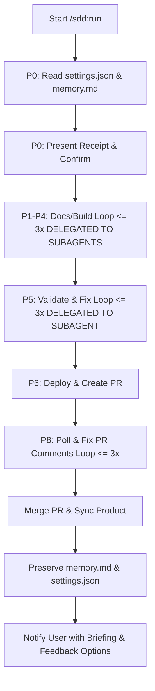

# Technical Design - SDD Full Automation Development

## Approach
We will enhance the instructions in `plugins/sdd/skills/run/SKILL.md` to support the full automation model. The updated skill instructions will guide the agent to:
1. Generate and present a structured "receipt" to the user for confirmation before checking out the feature branch.
2. Delegate phase-specific tasks (P1-P5) to token-optimized specialized subagents to conserve parent context and tokens.
3. Perform headless executions under `--mode=auto`, parse automation settings from `.sdd-docs/settings.json`, automatically execute inner loops (up to 3x) for reviews/validation fixes/PR comments, automatically merge the PR on approval, preserve memory/settings, and send a final briefing notification.

## Architecture Context
The design modifies the behavior of `/sdd:run` by integrating with:
- Specialized subagents: `sdd-analyst`, `sdd-architect`, `sdd-planner`, `sdd-coder`, `sdd-validator`.
- `plugins/git` skills (e.g., `branch-create`, `commit`, `push`)
- `plugins/gh-cli` skills (e.g., `pr-create`, `pr-respond`, `pr-merge`)
- `.sdd-docs/settings.json` configuration file
- `.sdd-docs/product/memory.md` memory log file



## Components
- **plugins/sdd/skills/run/SKILL.md**: Holds the revised instruction set for driving the end-to-end flow.
- **.sdd-docs/settings.json**: Schema template for controlling the automation configuration.

## Subagent Delegation Mapping
- **Phase P1 (Specs)**: Invokes `sdd-analyst` to execute grill -> specs -> specs-review.
- **Phase P2 (Design)**: Invokes `sdd-architect` to execute design -> design-review.
- **Phase P3 (Tasks)**: Invokes `sdd-planner` to execute tasks -> tasks-review.
- **Phase P4 (Build)**: Invokes `sdd-coder` to execute build -> build-review.
- **Phase P5 (Validation)**: Invokes `sdd-validator` to execute validate (and fix loop if needed).

## Interfaces
No new code interfaces are introduced. The existing command inputs to `/sdd:run` remain:
- `slug` (optional)
- `--mode=auto|manual` (default auto)
- `--from=<phase>`
- `--until=<phase>`

We also introduce parsing of `.sdd-docs/settings.json` configurations:
```json
{
  "max_loops": 3,
  "pr_polling": {
    "interval_seconds": 60,
    "max_attempts": 3
  },
  "auto_merge": true,
  "preserve_files": ["memory.md", "settings.json"]
}
```

## Data changes
None.

## Alternatives
- **Running a separate daemon service for webhooks**: Rejected because we are running in a terminal-based CLI context. Polling via `gh pr view` is much simpler and fits the existing toolset perfectly.

## Risks
- **Infinite Loop Risk**: If validation or reviews continuously fail, the agent could spin infinitely.
  - *Mitigation*: Hard loop limit of 3 is strictly enforced. If a loop reaches limit, the agent stops and reports the state.
- **Unintended Merges**: Automatically merging could merge faulty code.
  - *Mitigation*: Merge is only executed if PR checks pass and reviews are approved, or if explicitly configured.
