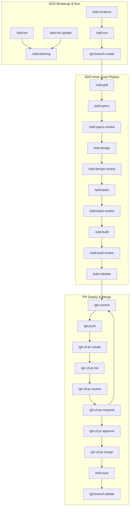

# Functional Specifications: Interactive Skill Connection Map

## Context
Google Antigravity plugin inspects and registers slash commands across multiple plugins (e.g. `sdd`, `git`, `gh-cli`). Currently, the lifecycle phases and connections between these commands are illustrated via a static, text-based linear grid in the `sdd` plugin's inspector dashboard. This makes it difficult for developers and agents to comprehend the loop flows, gated transition paths, and cross-plugin interactions.

This feature adds an interactive graphical map to [sdd/index.html](file:///home/kenneth-ancheta/src/github.com/agy-plugins/plugins/sdd/index.html) showing command connections, with real-time path tracing on hover/click and integration into the existing sidebar detail cards.

## Scope
### In-Scope
- Interactive, responsive, Vanilla JS/CSS graphical node map in [sdd/index.html](file:///home/kenneth-ancheta/src/github.com/agy-plugins/plugins/sdd/index.html) replacing the static pipeline tables.
- Mapping of 31 commands spanning `sdd`, `git`, and `gh-cli` plugins.
- Color-coding of command nodes according to origin plugin:
  - `sdd` commands: Amber / Yellow (#fbbf24)
  - `git` commands: Blue (#60a5fa)
  - `gh-cli` commands: Red / Pink (#f43f5e)
- Hover path tracing highlighting both incoming/outgoing paths and dimming non-related elements.
- Selection locking via click, enabling temporary preview hovers over secondary nodes.
- Animated path flow showing directionality of active links.
- Sidebar detail card updates matching the hovered/clicked command.
- Inline static mirror of all required `git` and `gh-cli` commands' description/policy/step configurations.

### Out-of-Scope / Non-goals
- Editing or modifying [git/index.html](file:///home/kenneth-ancheta/src/github.com/agy-plugins/plugins/git/index.html) or [gh-cli/index.html](file:///home/kenneth-ancheta/src/github.com/agy-plugins/plugins/gh-cli/index.html) views.
- Dynamic fetching of plugin data via AJAX or file-system lookups (requires all data to be loaded locally on load).
- Zooming, panning, or node-dragging interface actions.

## User Stories
- **As a Developer,** I want to view an interactive visual map of commands, so that I can easily trace how the SDD phases transition into git commits and GitHub pull requests.
- **As a Developer,** I want to click any command node on the map, so that the details card immediately displays its specific rules, policies, and steps.
- **As a Developer,** I want to hover over a command, so that I can see its direct upstream triggers and downstream outputs highlighted clearly.

## Acceptance Criteria
1. **Map Rendering & Node Layout:**
   - **Given** the user loads the SDD plugin inspector page,
   - **Then** a visually structured connection grid must render in place of the old pipeline panels.
   - **And** command nodes must be color-themed based on their host plugin (Amber for `sdd`, Blue for `git`, Pink/Red for `gh-cli`).
   - **And** directed edges (SVG paths with arrowhead markers) must link nodes to illustrate control flow/transitions.

2. **Hover Interactions:**
   - **Given** no node is selected,
   - **When** the cursor hovers over a command node,
   - **Then** the hovered node and its connected links must highlight (full opacity, increased stroke-width).
   - **And** all other nodes and edges must fade to an opacity of `0.15`.
   - **And** the details panel must display the metadata of the hovered command.
   - **When** the cursor leaves the node, the map and details panel must revert to default states.

3. **Click Selection Locking:**
   - **Given** the map is in its default state,
   - **When** a user clicks a command node,
   - **Then** the highlighted paths and details card must lock on that node.
   - **And** the corresponding command button in the sidebar list must become active (if it is an SDD command).
   - **When** the user hovers over another node while locked, the map must preview the new paths, and the details card must preview the hovered details.
   - **When** the cursor leaves, the view must revert to the locked command.
   - **When** the user clicks the locked node again or the map background, the selection must clear.

4. **Animated Path Flow:**
   - **Given** a path is highlighted (on hover or selection),
   - **Then** the SVG stroke must animate (e.g. `stroke-dasharray` transition) moving in the direction of the target node.

5. **Cross-Plugin Metadata Integration:**
   - **Given** a git or gh-cli node is clicked/hovered,
   - **Then** the details panel must render the correct policies and execution steps mirroring their original plugin configurations.

6. **Responsiveness:**
   - **Given** the screen width is less than `1024px`,
   - **Then** the map container must enable horizontal scrollbars (`overflow-x: auto`) rather than breaking the coordinate layout.

## Data Model

The map relies on a structured static JSON schema in the main page script.

### Entities:
- **Node**:
  - `id` (string, unique ID e.g. `"/sdd:grill"`)
  - `name` (string, short display name e.g. `"grill"`)
  - `plugin` (string: `"sdd"` | `"git"` | `"gh-cli"`)
  - `x` (number, horizontal coordinate percentage `0-100`)
  - `y` (number, vertical coordinate percentage `0-100`)
  - `phase` (string, optional: `"P1"`, `"P2"`, etc.)

- **Edge (Connection)**:
  - `from` (string, source Node `id`)
  - `to` (string, target Node `id`)
  - `type` (string: `"sequence"` | `"dependency"` | `"delegation"`)

### Complete Connection Graph Mapping:

## Non-Functional Requirements (NFR)
- **Zero Heavy Libraries:** No D3, vis.js, cytoscape, or canvas scripts allowed. Implementation must use standard HTML5, CSS3, and ES6+ Vanilla JS.
- **Performance:** Rendering the map must execute in <50ms. Hover triggers and animations must remain stable at 60fps.
- **Styling:** Glassmorphism card layouts must utilize variables defined in `:root`.
- **Accessibility:** All nodes must support keyboard tab-navigation and visual focus indications, updating details via Enter/Space presses.

## Open Questions & Assumptions
- **Question:** How do we map commands that can run independently (like `/git:status` or `/git:stash`)?
  - *Assumption:* Out of scope for main lifecycle connections. The map will prioritize command lines tied directly to the core SDD run phase and PR review loop, while standalone actions can remain in sidebars or simple nodes.
