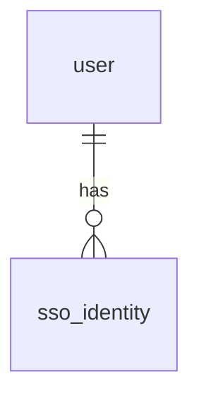

# Schema delta — Login (SSO)

<!-- consumed by /sdd:sync-product → merged into product/database/er-diagram.md -->

## Change summary
Adds `sso_identity` (maps an external IdP subject to a `user`). No changes to existing tables.

## New table
```
sso_identity
  id           uuid   pk
  user_id      uuid   fk → user.id
  provider     text   not null      -- e.g. "okta"
  subject      text   not null      -- IdP "sub"
  created_at   timestamptz
  unique (provider, subject)
```

## ER fragment

