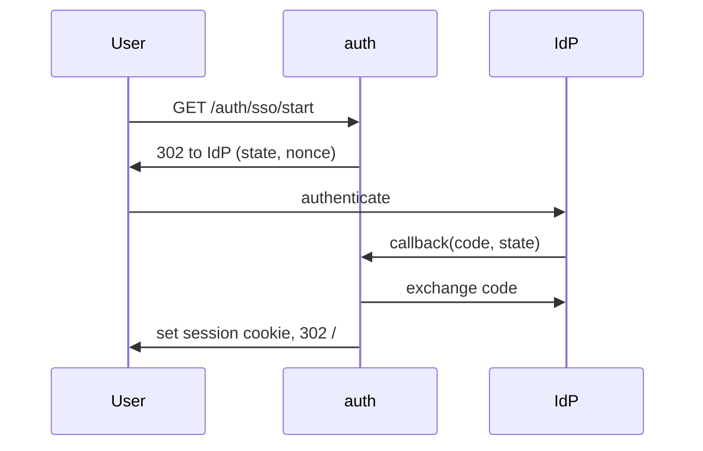

# Login (SSO) — Technical Design

<!-- schema: design | written by /sdd:design -->

## Approach
Implement the OIDC authorization-code flow in the existing `auth` service. Reuse the current
session issuer; add an `sso_identity` table to map IdP subjects to users.

## Architecture context
Module: `auth` (`/api/auth`). Consolidates into `product/features/login/`.

## Components
| Component | Responsibility | New/Modified |
|---|---|---|
| `auth.SSOHandler` | start + callback endpoints | New |
| `auth.SessionIssuer` | issue session cookie | Modified (reused) |
| `sso_identity` repo | CRUD on the new table | New |

## Interfaces
- `GET /auth/sso/start` → 302 to IdP.
- `GET /auth/sso/callback?code&state` → exchange, issue session, 302 to `/`.
See `api-diff.md`.

## Data / schema changes
Adds `sso_identity`. See `db-diff.md`.

## Sequence

## Alternatives considered
- SAML first — rejected: customers on OIDC; SAML deferred.

## Risks
- Replay of `state` → mitigated by single-use + 10 min TTL.
