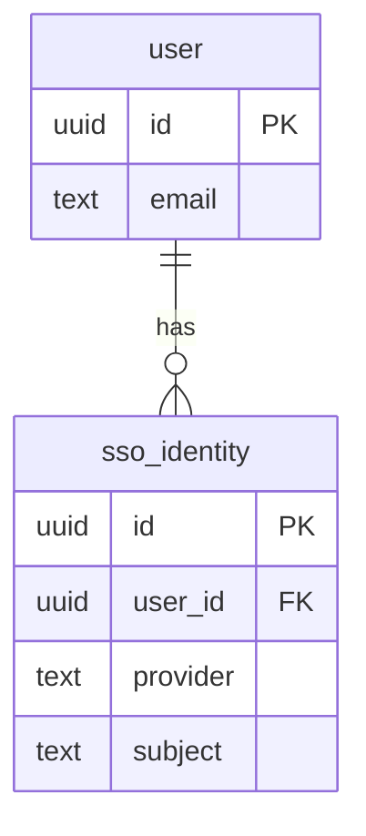

# Database — ER Diagram (as-built)

<!-- consolidated by /sdd:sync-product from per-feature db-diff.md files -->

```mermaid
erDiagram
  user ||--o{ sso_identity : has
  user {
    uuid id PK
    text email
  }
  sso_identity {
    uuid id PK
    uuid user_id FK
    text provider
    text subject
  }
```
