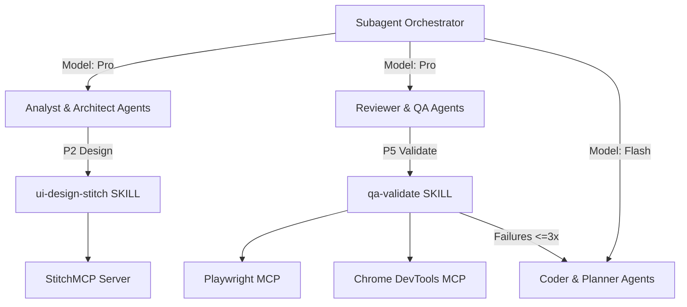

# System Design Specification: Enhance agy-plugins Productivity

## Approach
We will enhance `agy-plugins` by formalizing 5 core productivity capabilities across skills, rules, and subagent manifests in `plugins/kanche/`:
1. **Loop Engineering 2.0 State Engine**: Add `loop-state.json` persistence & evaluation logic in `plugins/kanche/rules/loop-engineering.md` and `plugins/kanche/skills/sdd-run/SKILL.md`.
2. **StitchMCP UI Design Skill**: Create `plugins/kanche/skills/ui-design-stitch/SKILL.md` to expose StitchMCP tools (`create_project`, `generate_screen_from_text`, `create_design_system`, `generate_variants`, `apply_design_system`).
3. **Playwright & Chrome DevTools MCP QA Skill**: Upgrade `plugins/kanche/skills/qa-validate/SKILL.md` to incorporate Playwright MCP tools (`browser_navigate`, `browser_screenshot`) and Chrome DevTools MCP tools (`a11y-debugging`, `debug-optimize-lcp`).
4. **Subagent Model Tiering**: Assign model declarations in `plugins/kanche/agents/*/` (`pro` for high reasoning, `flash` for fast implementation).
5. **Self-Healing Test Repair Loop**: Implement a 3-cycle automated repair loop between P5 validation failure and P4 code implementation.

## Architecture context



## Components

1. **Stitch UI Skill (`plugins/kanche/skills/ui-design-stitch/SKILL.md`)**
   - Responsibility: Interface for generating visual UI screens, design systems, and screen variants via StitchMCP during P2 design.
   - Files: `plugins/kanche/skills/ui-design-stitch/SKILL.md`

2. **QA Validate Skill (`plugins/kanche/skills/qa-validate/SKILL.md`)**
   - Responsibility: Run CLI test suites, invoke Playwright MCP for E2E browser checks, run Chrome DevTools accessibility audits, and manage self-healing repair loops.
   - Files: `plugins/kanche/skills/qa-validate/SKILL.md`

3. **Loop Engineering Rules (`plugins/kanche/rules/loop-engineering.md`)**
   - Responsibility: Rule definitions for paired generator-reviewer evaluation, `sdd-review` parsing, and `loop-state.json` persistence.
   - Files: `plugins/kanche/rules/loop-engineering.md`

4. **Agent Definitions (`plugins/kanche/agents/`)**
   - Responsibility: Config manifests specifying subagent model assignments (`pro` for analyst/architect/reviewer/qa, `flash` for coder/planner/operators).
   - Files: `plugins/kanche/agents/analyst/agent.json`, `architect/agent.json`, `coder/agent.json`, `planner/agent.json`, `validator/agent.json`

## Interfaces

- **`sdd-review` JSON schema**:
  ```json
  {
    "verdict": "GO | NO-GO",
    "loop_iteration": "1/3",
    "findings": [
      {
        "severity": "blocker | major | nit",
        "msg": "string",
        "file": "string",
        "line": 0,
        "fix_suggestion": "string"
      }
    ]
  }
  ```

- **`loop-state.json` Schema**:
  ```json
  {
    "slug": "string",
    "phases": {
      "P1": { "iteration": 1, "verdict": "GO" },
      "P2": { "iteration": 1, "verdict": "GO" },
      "P3": { "iteration": 1, "verdict": "GO" },
      "P4": { "iteration": 1, "verdict": "GO" },
      "P5": { "iteration": 1, "verdict": "GO" }
    }
  }
  ```

## Data changes
No database tables. File state changes only (`loop-state.json` under `docs/development/{slug}/`).

## Alternatives
- **Manual review without closed loops**: Rejected because manual loops waste developer tokens and time.
- **Single model for all agents**: Rejected because using `pro` for simple formatting is wasteful, and using `flash` for complex architecture leads to quality degradation.

## Risks
- **MCP server availability**: If Playwright or StitchMCP servers are missing, fallback cleanly to CLI test runner and text-based mockups.
